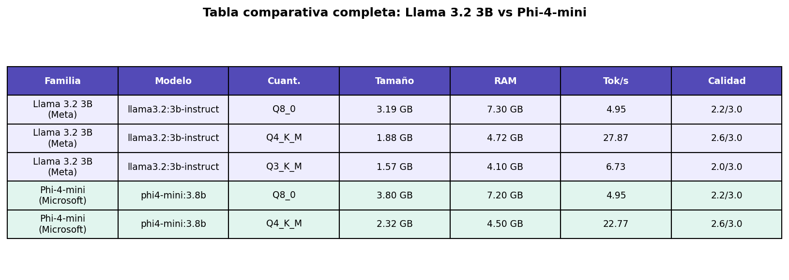
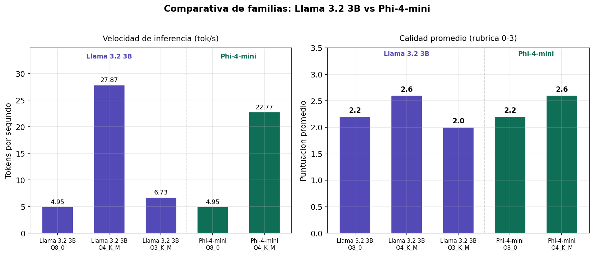
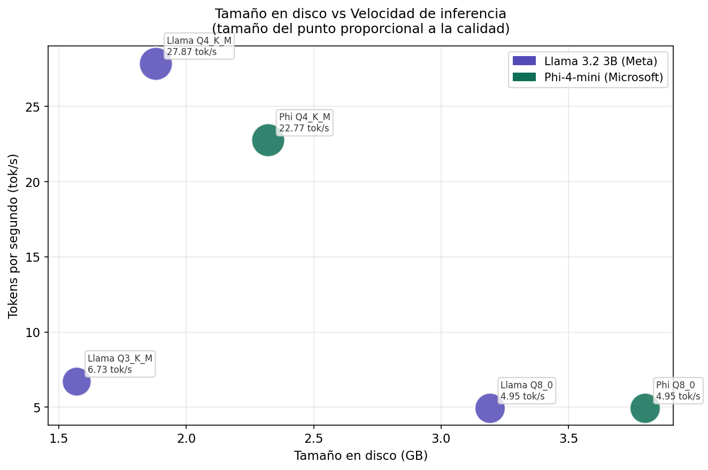
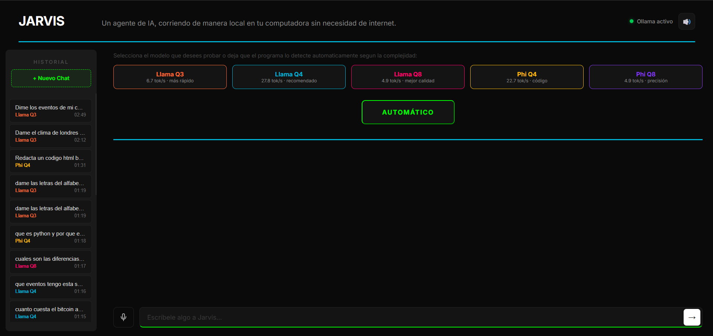
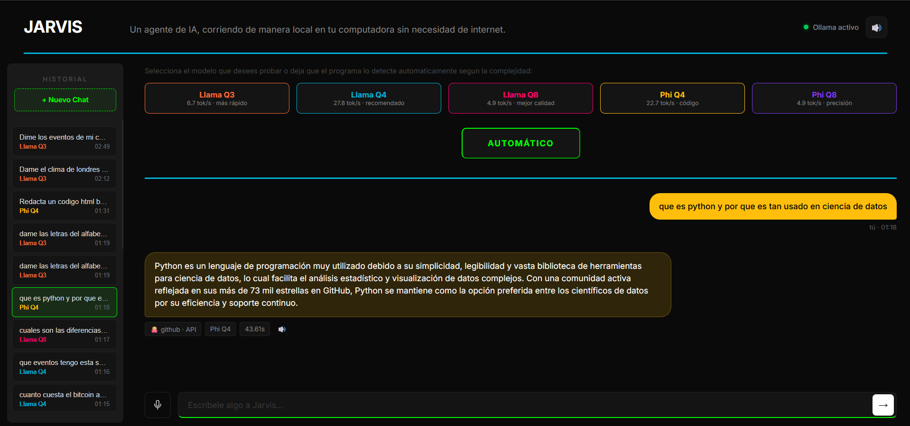
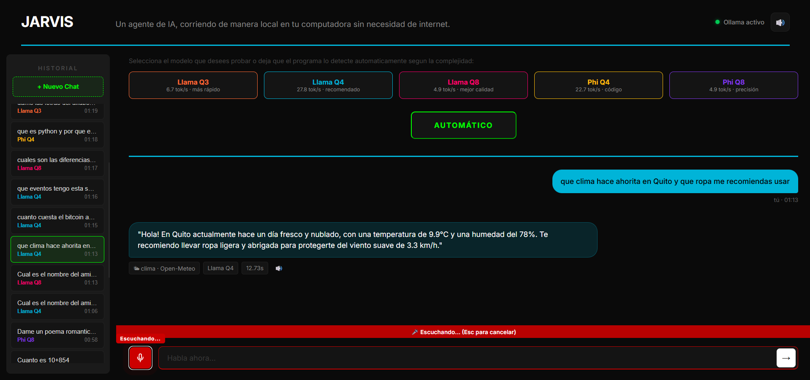

<div align="center">

# 🤖 Jarvis — Asistente IA local sin GPU


**Proyecto final del curso: Aprendizaje Automático Aplicado — Sistemas LLM Locales**

</div>

---

## ¿Qué es Jarvis?

Jarvis es un asistente de IA que corre completamente en mi computadora, sin necesidad de internet para el modelo principal ni de una GPU dedicada. Lo construí desde cero para entender cómo funcionan los LLMs locales por dentro, cuánta RAM consumen, qué tan rápido generan texto, cómo se degradan al comprimir sus pesos, y dónde fallan cuando el hardware es limitado.

No compite con ChatGPT ni pretende hacerlo. Lo interesante es que puedes ver exactamente por qué es más lento y más limitado, con números reales medidos en mi propio hardware.

Jarvis tiene 4 capacidades principales:

- 💬 **Chat directo** con el modelo Llama 3.2 3B corriendo 100% local
- 📚 **RAG** — busca en un corpus de texto antes de responder, en lugar de inventar
- 🔧 **6 herramientas externas** — clima, cripto, GitHub y Google Calendar en tiempo real
- 🧪 **Evaluación automática** — un test set de 20 prompts con métricas reproducibles

---

## Hardware usado

| Componente | Especificación |
|---|---|
| CPU | Intel Core i5-13420H (8 núcleos / 12 hilos, 2.1 GHz base) |
| RAM | 16 GB DDR5 5200 MT/s — ~7.9 GB disponibles en reposo |
| GPU | ❌ Sin GPU dedicada — inferencia 100% en CPU |
| SO | Windows 11 |
| Disco | SSD — mínimo 20 GB libres para modelos |

> El hardware sin GPU es una restricción intencional del proyecto. Fuerza a que cada decisión técnica tenga una consecuencia observable: la cuantización, el tamaño del contexto y la velocidad de inferencia se vuelven medibles y significativos.

---

## Arquitectura del sistema

<div align="center">

```
                        USUARIO (terminal)
                               │
                    pregunta en lenguaje natural
                               │
                               ▼
              ┌────────────────────────────────────┐
              │       jarvis_agent.py              │
              │         (orquestador)              │
              │                                    │
              │  1. Decide si necesita herramienta │
              │  2. Ejecuta la herramienta         │
              │  3. Genera respuesta natural       │
              └─────────┬──────────┬──────────┬────┘
                        │          │          │
             ┌──────────┘          │          └──────────┐
             ▼                     ▼                     ▼
    ┌─────────────────┐  ┌─────────────────┐  ┌─────────────────┐
    │ rag_pipeline.py │  │  Ollama (local) │  │ herramientas.py │
    │                 │  │                 │  │                 │
    │  ChromaDB       │  │ llama3.2:3b     │  │  • Clima        │
    │  178 chunks     │  │ q4_K_M          │  │  • Cripto       │
    │  Don Quijote    │  │ puerto 11434    │  │  • GitHub       │
    │  embeddings     │  │ sin GPU         │  │  • Calendario   │
    └─────────────────┘  └─────────────────┘  └────────┬────────┘
                                                       │
                                                       ▼
                                          ┌─────────────────────────┐
                                          │     APIs externas       │
                                          │                         │
                                          │  Open-Meteo  CoinGecko  │
                                          │  GitHub API  G.Calendar │
                                          └─────────────────────────┘
```

</div>


---
## Requisitos previos

Antes de clonar el repo se requiere tener instalado lo siguiente:

| Herramienta | Versión mínima | Para qué sirve |
|---|---|---|
| Python | 3.10 o superior | correr todos los scripts |
| Ollama | última versión | servir el modelo local |
| Git | cualquier versión reciente | clonar el repositorio |
| Espacio en disco | 20 GB libres | modelos + dependencias |

> Si estás en Windows, todos los comandos de esta guía funcionan en PowerShell o CMD.

---

## Instalación rápida

**Paso 1 — Clonar el repositorio:**

```bash
git clone https://github.com/Andr3sss/jarvis.git
cd jarvis
```

**Paso 2 — Instalar todas las dependencias Python de una vez:**

```bash
pip install requests psutil matplotlib pandas chromadb sentence-transformers langchain langchain-community pymupdf google-auth google-auth-oauthlib google-auth-httplib2 google-api-python-client
```

Esto tarda entre 5 y 10 minutos dependiendo de tu internet. Espera a que termine completamente antes de continuar.

**Paso 3 — Instalar Ollama:**

Ve a [ollama.com/download](https://ollama.com/download) y descarga el instalador para tu sistema operativo. En Windows simplemente ejecuta el `.exe` y sigue el instalador con las opciones por defecto.

Verifica que quedó instalado:

```bash
ollama --version
```

---

## Descargar los modelos

Jarvis usa el mismo modelo base en tres niveles de cuantización distintos para el estudio comparativo de la Parte A. Descárgalos en este orden:

```bash
ollama pull llama3.2:3b-instruct-q4_K_M
ollama pull llama3.2:3b-instruct-q8_0
ollama pull llama3.2:3b-instruct-q3_K_M
```

También necesitas el modelo de embeddings para el RAG:

```bash
ollama pull nomic-embed-text
```

Las descargas en total pesan aproximadamente 8 GB. Puedes iniciar la primera y avanzar con la configuración de Google Calendar mientras descarga.

Verifica que los cuatro quedaron instalados:

```bash
ollama list
```

---

## Configurar Google Calendar (opcional)

Esta parte es solo necesaria si quieres usar las funciones de calendario. Si prefieres saltarla, Jarvis funciona perfectamente con las otras 5 herramientas.

**Paso 1** — Ve a [console.cloud.google.com](https://console.cloud.google.com) y crea un proyecto nuevo llamado `jarvis-calendar`.

**Paso 2** — Habilita la Google Calendar API buscándola en la barra de búsqueda y haciendo clic en "Enable".

**Paso 3** — Ve a APIs & Services > Credentials > Create Credentials > OAuth client ID. Selecciona "Desktop app" como tipo de aplicación.

**Paso 4** — Descarga el archivo JSON de credenciales, renómbralo a `credentials.json` y colócalo en la carpeta `mcp_tools/` del proyecto.

**Paso 5** — La primera vez que corras el calendario, se abrirá el navegador para que autorices el acceso. Aparecerá una advertencia de Google que dice "app no verificada" ya que es una app personal. Haz clic en "Avanzado" y luego en "Ir a Jarvis Calendar". Es completamente seguro.

---

## Construir el índice RAG

El corpus de Don Quijote ya está en `data/corpus.txt`. Solo necesitas construir el índice una vez:

```bash
python rag/rag_pipeline.py --build
```

Esto tarda entre 3 y 8 minutos. Solo se hace una vez. Después de esto ya puedes hacer preguntas con contexto del libro.

---
## Resultados y métricas

Todos los números de esta sección vienen de mediciones reales en el hardware descrito arriba. Nada inventado, nada estimado. Puedes reproducirlos corriendo los scripts de benchmarking incluidos en el repo.

---

### Parte A — Comparativa de cuantización

Se tomó el mismo modelo base `llama3.2:3b` y se midió en tres niveles de compresión distintos. La idea era ver exactamente cuánto se gana en velocidad y cuánto se pierde en calidad al comprimir más agresivamente los pesos.

| Modelo | Tamaño en disco | RAM usada | Velocidad | Calidad (0 a 3) |
|---|---|---|---|---|
| llama3.2:3b Q8_0 | 3.19 GB | 7.30 GB | 4.95 tok/s | 2.2 / 3.0 |
| llama3.2:3b Q4_K_M | 1.88 GB | 4.72 GB | 27.87 tok/s | 2.6 / 3.0 |
| llama3.2:3b Q3_K_M | 1.57 GB | 4.10 GB | 6.73 tok/s | 2.0 / 3.0 |

La calidad se midió con una rúbrica de 0 a 3 puntos sobre 5 preguntas estándar que cubren matemáticas, código, resumen, hechos históricos y razonamiento lógico.

**Lo que se puede ver claramente:** Q4_K_M ganó en todos los frentes. Fue el más rápido por diferencia, con la mejor calidad del grupo y un tamaño manejable en RAM. Q8_0 consume casi el doble de RAM que Q4 pero genera texto a una quinta parte de la velocidad. Q3_K_M es el más liviano pero introduce alucinaciones factuales concretas, como inventar nombres de autores inexistentes en la pregunta de hechos.

> El modelo elegido para el resto del proyecto fue `llama3.2:3b-instruct-q4_K_M` por ser el punto óptimo entre velocidad, calidad y uso de RAM en este hardware.

Para reproducir estas mediciones:

```bash
python benchmarks/benchmark_quant.py
```

---

### Parte B — Experimento de KV cache

Se tomó el modelo ganador (Q4_K_M) y se midió cómo cambia el rendimiento cuando el contexto crece. La caché KV guarda los vectores de atención de cada token previo, así que a más contexto, más memoria y más tiempo de cómputo.

| Contexto (tokens) | Velocidad | Tiempo total | Estado |
|---|---|---|---|
| 512 | 3.81 tok/s | 29.4 s | Normal |
| 2048 | 2.59 tok/s | 38.7 s | Normal |
| 8192 | 5.60 tok/s | 18.4 s | KV cache reutilizada |
| 16384 | 0.30 tok/s | 358.2 s | Swap activado |

**Lo interesante:** el contexto de 8192 tokens fue más rápido que el de 2048. Esto pasó porque Ollama reutilizó la caché KV del prompt anterior que ya estaba cargado en memoria, así que no recomputó todo desde cero. Es el KV cache funcionando exactamente como debe. A 16384 tokens la máquina entró en swap, usando el disco como RAM adicional, lo que explica la caída brutal de 5.6 a 0.3 tok/s.

Para reproducir estas mediciones:

```bash
python benchmarks/benchmark_kvcache.py
```

---

### Parte C — RAG vs sin RAG

Se comparó la misma pregunta respondida de dos formas: el modelo respondiendo de memoria versus el modelo leyendo primero fragmentos reales del corpus de Don Quijote.

El corpus tiene 160,103 caracteres de los primeros capítulos del libro, divididos en 178 chunks de aproximadamente 1,000 caracteres cada uno con 100 caracteres de solapamiento entre chunks consecutivos.

| Pregunta | Sin RAG | Con RAG |
|---|---|---|
| Nombre del caballo de Don Quijote | Inventa explicación falsa del nombre "Rocinante" | Cita textual: "alto, sonoro y significativo" |
| Quién es Aldonza Lorenzo | "No tengo información sobre esa persona" | Explica el vínculo con Dulcinea citando el texto |
| Episodio de los molinos de viento | Inventa una "dama de Lorna" que no existe | Cita "embistió el primer molino" del texto real |
| Descripción de armas y caballo | Inventa características físicas | Cita "lanza en astillero", "adarga antigua", "rocín flaco" |
| Por qué se hizo caballero andante | Respuesta genérica sobre soledad y aventura | Cita las reglas de caballería del texto |

**El patrón es consistente:** sin RAG el modelo o alucina detalles inventados o admite que no sabe. Con RAG cita frases reales del libro. La diferencia más llamativa fue en Aldonza Lorenzo, un personaje secundario que el modelo 3B simplemente no conoce de memoria pero que el retriever encontró en el Chunk 11 con similitud 0.597.

Para probar el RAG:

```bash
python rag/rag_pipeline.py --compare "tu pregunta sobre Don Quijote"
```

---

### Parte D — Las 6 herramientas externas

Jarvis puede llamar a herramientas externas en tiempo real. El modelo decide cuál usar según la pregunta, genera un JSON con los parámetros, y Python ejecuta la función correspondiente y devuelve los datos reales.

| Herramienta | Fuente | API key | Ejemplo de uso |
|---|---|---|---|
| Clima | Open-Meteo | No necesita | "qué clima hace en Quito ahorita" |
| Precio cripto | CoinGecko | No necesita | "cuánto cuesta el bitcoin en dólares" |
| Info GitHub | GitHub API pública | No necesita | "cuántas estrellas tiene ollama/ollama" |
| Eventos de hoy | Google Calendar | OAuth propio | "qué tengo hoy en mi calendario" |
| Próximos eventos | Google Calendar | OAuth propio | "qué eventos tengo esta semana" |
| Buscar eventos | Google Calendar | OAuth propio | "tengo algo de Ecuador en el calendario" |

**Fallos documentados:**

El sistema falla de forma controlada en estos casos conocidos:

- Ciudad fuera de la base de datos: `"qué clima hace en Pacto Ecuador"` devuelve "Ciudad no disponible" sin inventar datos
- Repositorio inexistente: `"estrellas de usuariofalso999/repofalso123"` devuelve error 404 sin alucinar
- Moneda inventada: `"bitcoin en moneda xyz"` devuelve error de la API sin inventar un precio

Estos fallos son esperados y deseables. El sistema falla con gracia en lugar de inventar información falsa.

Para probar cualquier herramienta:

```bash
python mcp_tools/jarvis_agent.py --pregunta "tu pregunta aquí"
```

---

### Parte E — Evaluación automatizada

Se diseñó un test set de 20 prompts distribuidos en 5 categorías y se corrió de forma automática con criterios de evaluación objetivos.

| Categoría | Prompts | Éxitos | Tasa de éxito | Latencia promedio |
|---|---|---|---|---|
| Chat puro | 4 | 3 | 75% | 32.9 s |
| RAG requerido | 4 | 3 | 75% | 40.7 s |
| Herramienta requerida | 4 | 4 | 100% | 17.4 s |
| Multistep | 4 | 1 | 25% | 13.6 s |
| Adversarial | 4 | 2 | 50% | 10.4 s |
| **Global** | **20** | **13** | **65%** | **22.9 s** |

**Lo que estos números dicen:** la categoría de herramientas alcanzó el 100% porque el formato JSON del tool calling es predecible y el modelo lo sigue bien en preguntas directas. Las preguntas multistep cayeron al 25% porque combinar una herramienta con razonamiento adicional en un solo paso es difícil para un modelo de 3 parámetros corriendo en CPU. El 65% global es honesto y reproducible.

Para reproducir la evaluación completa:

```bash
python eval/eval_runner.py
```

Los resultados detallados quedan en `eval/eval_results.json` y el resumen en `eval/eval_summary.csv`.

---

## Cómo usar Jarvis

Antes de cualquier cosa, verifica que Ollama esté corriendo. En Windows arranca automáticamente al encender el equipo. Si por alguna razón no responde, búscalo en la barra de tareas cerca del reloj y haz clic derecho > Restart.

Todos los comandos se ejecutan desde la carpeta raíz del proyecto:

```bash
cd C:\Users\TU_NOMBRE\jarvis
```

---

### Chat directo con el modelo

Para hacerle una pregunta al modelo sin RAG ni herramientas, directamente desde Ollama:

```bash
ollama run llama3.2:3b-instruct-q4_K_M "tu pregunta aquí"
```

Ejemplos que funcionan bien:

```bash
ollama run llama3.2:3b-instruct-q4_K_M "explicame que es la cuantizacion en modelos de IA"
ollama run llama3.2:3b-instruct-q4_K_M "cual es la diferencia entre RAM y disco duro"
ollama run llama3.2:3b-instruct-q4_K_M "para que sirve Python en ciencias de la computacion"
```

---

### RAG sobre Don Quijote

Primero asegúrate de haber construido el índice al menos una vez con `python rag/rag_pipeline.py --build`. Después puedes hacer preguntas o comparar respuestas:

**Solo con RAG:**

```bash
python rag/rag_pipeline.py --query "que nombre le puso don quijote a su caballo"
```

**Comparar RAG vs sin RAG lado a lado:**

```bash
python rag/rag_pipeline.py --compare "quien es Aldonza Lorenzo y que tiene que ver con don quijote"
python rag/rag_pipeline.py --compare "que paso cuando don quijote se encontro con los molinos de viento"
python rag/rag_pipeline.py --compare "como describe cervantes las armas y el caballo de don quijote"
```

Preguntas que funcionan bien son las que hablan de personajes, episodios o descripciones de los primeros capítulos del libro. Preguntas sobre capítulos tardíos del libro van a fallar porque el corpus solo cubre los primeros 160,000 caracteres.

---

### Jarvis con herramientas externas

El orquestador principal. Recibe cualquier pregunta en lenguaje natural, decide qué herramienta usar y devuelve una respuesta con datos reales:

```bash
python mcp_tools/jarvis_agent.py --pregunta "tu pregunta aquí"
```

**Clima:**

```bash
python mcp_tools/jarvis_agent.py --pregunta "que clima hace ahorita en Quito"
python mcp_tools/jarvis_agent.py --pregunta "que clima hace en Madrid y que ropa me recomiendas"
```

**Criptomonedas:**

```bash
python mcp_tools/jarvis_agent.py --pregunta "cuanto cuesta el bitcoin ahorita en dolares"
python mcp_tools/jarvis_agent.py --pregunta "el ethereum esta subiendo o bajando hoy"
```

**GitHub:**

```bash
python mcp_tools/jarvis_agent.py --pregunta "cuantas estrellas tiene el repo ollama/ollama en github"
python mcp_tools/jarvis_agent.py --pregunta "que lenguaje usa el repo python/cpython y cuantos forks tiene"
```

**Google Calendar:**

```bash
python mcp_tools/jarvis_agent.py --pregunta "que eventos tengo hoy en mi calendario"
python mcp_tools/jarvis_agent.py --pregunta "cuales son mis proximos eventos de esta semana"
python mcp_tools/jarvis_agent.py --pregunta "tengo algun partido de Ecuador proximamente"
```

**Modo interactivo** para hacer varias preguntas seguidas sin tener que escribir el comando completo cada vez:

```bash
python mcp_tools/jarvis_agent.py
```

Escribe `salir` para terminar la sesión.

---

### Preguntas que fallan a propósito

Estas son las preguntas trampa que demuestran que el sistema falla con gracia en lugar de inventar datos:

```bash
python mcp_tools/jarvis_agent.py --pregunta "que clima hace en Pacto Ecuador"
python mcp_tools/jarvis_agent.py --pregunta "cuantas estrellas tiene el repo usuariofalso999/repofalso123"
python mcp_tools/jarvis_agent.py --pregunta "cuanto cuesta el bitcoin en una moneda inventada llamada xyz"
```

---

### Ejecutar la evaluación automatizada

Corre los 20 prompts del test set y genera las métricas. Tarda entre 20 y 40 minutos en CPU:

```bash
python eval/eval_runner.py
```

Los resultados se guardan en:

```
eval/eval_results.json     detalle completo de cada prompt
eval/eval_summary.csv      métricas por categoría para el informe
```

---

### Ver la agenda del calendario en formato mas entendible

Para ver tus eventos de forma legible sin pasar por el modelo:

```bash
python mcp_tools/calendario_google.py
```

Muestra los eventos de hoy, los próximos 7 días y una búsqueda por "Ecuador" organizados por categoría con íconos.

---

## Límites honestos del sistema

Jarvis funciona bien en tareas simples y directas. Donde empieza a fallar es cuando la tarea requiere varios pasos de razonamiento encadenados o cuando el hardware se convierte en el cuello de botella real.

**Lo que falla y por qué:**

Las preguntas multistep son el talón de Aquiles del sistema. Pedirle al modelo que consiga datos de una API Y además razone sobre ellos en una sola respuesta es demasiado para un modelo de 3 parámetros. En la evaluación automatizada esta categoría tuvo solo un 25% de éxito. El modelo completa uno de los dos pasos pero raramente los dos bien.

El tool calling con preguntas ambiguas también falla. Si la pregunta no menciona claramente qué tipo de información se necesita, el modelo a veces genera JSON inválido o elige la herramienta incorrecta. En comparación, modelos de nube como Claude o GPT nunca fallan en seguir el formato de tool calling porque tienen muchos más parámetros y entrenamiento específico en ese tipo de tareas.

El contexto de 16,384 tokens es el límite físico del hardware. Con 7.9 GB de RAM disponible, ese tamaño de contexto activa el swap del sistema operativo y la velocidad cae de 5.6 a 0.3 tokens por segundo, haciendo la experiencia prácticamente inutilizable.

El RAG con texto en español del siglo XVII fue más difícil de lo esperado. El modelo de embeddings `all-MiniLM-L6-v2` no relacionaba bien las preguntas modernas con el vocabulario antiguo de Cervantes. Se resolvió cambiando a `paraphrase-multilingual-MiniLM-L12-v2` y reescribiendo el prompt del contexto para que el modelo supiera que estaba leyendo español antiguo.

**Dos mejoras concretas con más recursos:**

Con el doble de RAM disponible (32 GB) o una GPU pequeña como una RTX 3060, se podrían hacer dos cosas que cambiarían bastante el sistema. Primero, cargar el modelo Q8_0 sin restricciones de RAM y con la GPU manejando la inferencia se llegaría a velocidades de 80 a 100 tokens por segundo, lo que haría las tareas multistep mucho más viables porque el tiempo de espera entre pasos dejaría de ser un problema. Segundo, indexar el corpus completo de Don Quijote en lugar de solo los primeros 160,000 caracteres, lo que mejoraría el RAG en preguntas sobre episodios de capítulos tardíos del libro.

---

## Estructura del repositorio

```
jarvis/
├── benchmarks/
│   ├── benchmark_quant.py       estudio de cuantización Parte A
│   ├── benchmark_kvcache.py     experimento KV cache Parte B
│   ├── generar_graficas.py      genera las 6 gráficas del informe
│   └── respuestas_calidad.txt   respuestas puntuadas con la rúbrica
├── data/
│   └── corpus.txt               corpus Don Quijote (160k caracteres)
├── eval/
│   ├── test_set.json            20 prompts de evaluación categorizados
│   ├── eval_runner.py           script de evaluación automática
│   ├── eval_results.json        resultados detallados por prompt
│   └── eval_summary.csv         métricas por categoría
├── mcp_tools/
│   ├── herramientas.py          registro de las 6 herramientas
│   ├── jarvis_agent.py          orquestador principal
│   └── calendario_google.py     integración Google Calendar
├── rag/
│   ├── rag_pipeline.py          pipeline RAG completo
│   └── chroma_db/               índice vectorial persistente
├── report/
│   └── capturas/                capturas de pantalla para el informe
├── measurements.csv             todas las mediciones de rendimiento
└── README.md                    esta guía
```

---

# Bonus 
## Comparativa entre familias de modelos

Como extensión del estudio principal, se evaluó una segunda familia de modelos para comparar directamente el comportamiento de arquitecturas distintas bajo las mismas condiciones de hardware y las mismas tareas.

### Modelos evaluados

| Familia | Empresa | Modelo | Parámetros |
|---|---|---|---|
| Llama 3.2 | Meta | llama3.2:3b-instruct | 3B |
| Phi-4-mini | Microsoft | phi4-mini:3.8b | 3.8B |

Llama 3.2 fue entrenado sobre un corpus generalista masivo. Phi-4-mini fue entrenado principalmente sobre datos sintéticos de alta calidad con foco específico en razonamiento, matemáticas y function calling nativo. Esa diferencia de filosofía de entrenamiento se refleja en los resultados.

---

### Tabla comparativa completa



---

### Velocidad y calidad lado a lado



**En velocidad:** Llama 3.2 Q4_K_M fue más rápido (27.87 tok/s) que Phi-4-mini Q4_K_M (22.77 tok/s) con un modelo base más pequeño. Ambos modelos en Q8_0 llegaron exactamente al mismo resultado de 4.95 tok/s, lo que sugiere que en ese nivel el cuello de botella es el ancho de banda del bus de memoria y no la arquitectura del modelo.

**En calidad:** Ambas familias alcanzaron el mismo promedio en Q4_K_M (2.6/3.0) y Q8_0 (2.2/3.0), pero con patrones de fallo distintos. Phi-4-mini fue superior en código generando comentarios explicativos línea por línea. Por otro lado, Phi-4-mini Q8_0 falló en la pregunta de resumen generando tres párrafos distintos en lugar de un único resumen de 3 oraciones, lo que sugiere menor robustez ante instrucciones de formato estricto.

**En hechos históricos:** Phi-4-mini Q4_K_M inventó autores del paper "Attention is All You Need" que no existen, mientras que Llama 3.2 Q4_K_M identificó correctamente a Vaswani et al. Esto es llamativo dado que Phi-4-mini se promociona con mayor precisión en razonamiento.

---

### Tamaño vs velocidad ambas familias



**Conclusión:** para este hardware y estas tareas, Llama 3.2 3B Q4_K_M sigue siendo la mejor opción: es más rápido, ocupa menos RAM y tiene comportamiento más predecible ante instrucciones de formato. Phi-4-mini es una alternativa válida especialmente si las tareas involucran principalmente código o razonamiento lógico paso a paso.

---

### Reproducir la comparativa

```bash
# Descargar los modelos de Phi-4-mini
ollama pull phi4-mini:3.8b-q4_K_M
ollama pull phi4-mini:3.8b-q8_0

# Ejecutar el benchmark comparativo
python benchmarks/benchmark_phi4.py

# Generar las 3 graficas comparativas
python benchmarks/generar_grafica_bonus.py
```

---

## Interfaz gráfica local

Jarvis tiene una interfaz web que corre completamente en tu máquina. No necesita internet, no sube nada a ningún servidor. La abres en el navegador como cualquier página web pero todo el procesamiento ocurre localmente.

### Cómo levantar la interfaz

**Paso 1 — Instalar Flask si no lo tienes:**
```bash
pip install flask flask-cors
```

**Paso 2 — Arrancar el servidor:**
```bash
python jarvis_server.py
```

Verás esto en la terminal cuando esté listo:
```
=======================================================
  JARVIS SERVER
  http://localhost:5000
=======================================================
[RAG] Cargando indice ChromaDB...
[RAG] Indice cargado: 178 chunks disponibles
=======================================================
```

**Paso 3 — Abrir en Chrome:**
```
http://localhost:5000
```

Usa Chrome o Edge. Firefox no soporta el control por voz.

---

### Pantalla principal



La interfaz tiene tres zonas principales:

El **historial** en el panel izquierdo guarda todas las conversaciones anteriores con el nombre del modelo que se usó en cada una y la hora. Haz clic en cualquier conversación para volver a verla. El botón "Nuevo Chat" limpia el área de conversación para empezar desde cero.

Los **5 botones de modelo** en la parte superior te permiten elegir manualmente con qué modelo quieres hablar. Cada botón muestra la velocidad real medida en tok/s y una descripción de para qué es mejor ese modelo. El botón AUTOMÁTICO deja que Jarvis elija el modelo más adecuado según el contenido de tu pregunta.

El **cajón de texto** en la parte inferior es donde escribes tus preguntas. El borde del cajón cambia de color según el modelo activo.

---

### Conversación activa con enrutamiento automático



Cuando recibes una respuesta, debajo de cada burbuja aparecen tres chips de información:

El primero indica qué herramienta externa usó Jarvis, si es que usó alguna. Por ejemplo `clima · Open-Meteo` cuando consultó el clima, `github · API` cuando consultó un repositorio, o `RAG · Don Quijote` cuando buscó en el corpus del libro.

El segundo muestra el modelo que generó la respuesta. Si tienes el modo AUTOMÁTICO activo, este chip te dice cuál eligió Jarvis por ti y por qué.

El tercero muestra cuántos segundos tardó en responder. Esto es útil para comparar la velocidad entre modelos directamente en la conversación.

---

### Enrutamiento automático de modelos

Con el botón AUTOMÁTICO activo, Jarvis analiza cada pregunta y elige el modelo óptimo antes de responder. La lógica es esta:

| Tipo de pregunta | Modelo elegido | Razón |
|---|---|---|
| Preguntas sobre clima, cripto, calendario, GitHub | Llama Q4 | Tool calling confiable |
| Preguntas sobre Don Quijote | Llama Q4 | RAG con contexto largo |
| Preguntas de código, matemáticas, lógica | Phi Q4 | Entrenado en razonamiento |
| Preguntas complejas que piden análisis o comparación | Llama Q8 | Mayor calidad de respuesta |
| Preguntas cortas y simples | Llama Q3 | Más rápido para respuestas directas |

El historial muestra exactamente qué modelo se usó en cada conversación, lo que permite comparar resultados entre modelos de forma visual.

---

### Control por voz



Jarvis tiene control por voz de entrada y salida usando la Web Speech API nativa de Chrome.

**Para hablar:** haz clic en el ícono del micrófono en la esquina inferior izquierda o presiona la **barra espaciadora** cuando el cajón de texto no esté enfocado. El botón se pone rojo con una animación pulsante y aparece la barra roja "Escuchando..." en la parte inferior. Habla tu pregunta con normalidad. Cuando terminas de hablar, el texto aparece en el cajón y se envía automáticamente a Jarvis sin que tengas que tocar nada.

**Para cancelar mientras grabas:** presiona **Escape**.

**Jarvis responde en voz alta:** cada respuesta de Jarvis se lee automáticamente por los parlantes. El ícono de altavoz en el encabezado permite silenciar esta función. También puedes hacer clic en el ícono de sonido que aparece en cada burbuja para escuchar cualquier respuesta anterior.

**Nota técnica:** el reconocimiento de voz usa la Web Speech API del navegador, que delega la transcripción al motor nativo de Chrome. La inferencia del modelo de lenguaje sigue siendo 100% local. Como mejora futura, integrar Whisper local eliminaría esta dependencia externa para lograr un sistema completamente offline de punta a punta.


### Cómo parar el servidor

En la terminal donde corre `jarvis_server.py` presiona `Ctrl + C`.

---

## Declaración de uso de IA

Este proyecto utilizó Claude Sonnet 4.6 de Anthropic como asistente durante el desarrollo. A continuación el detalle de cómo y en qué secciones:

**Código:** Claude ayudó a escribir y depurar los scripts `rag_pipeline.py`, `jarvis_agent.py`, `herramientas.py`, `calendario_google.py`, `benchmark_quant.py`, `benchmark_kvcache.py`, `generar_graficas.py` y `eval_runner.py`. En todos los casos el código fue revisado, ejecutado y verificado en el hardware real antes de incluirlo en el repositorio.

**Mediciones y puntuaciones:** Todas las mediciones de velocidad, RAM y calidad fueron realizadas personalmente en mi propio hardware. Claude no tuvo acceso a los resultados reales hasta que ya estaban medidos y registrados en el CSV.

**Lo que NO hizo Claude:** no ejecutó ningún modelo, no midió ningún número, no accedió a las APIs externas y no tomó ninguna decisión de diseño del sistema sin consulta y mi aprobación.

---

## Autor

**Dilan Andrés Quisilema Guamán**
Curso: Machine Learning
